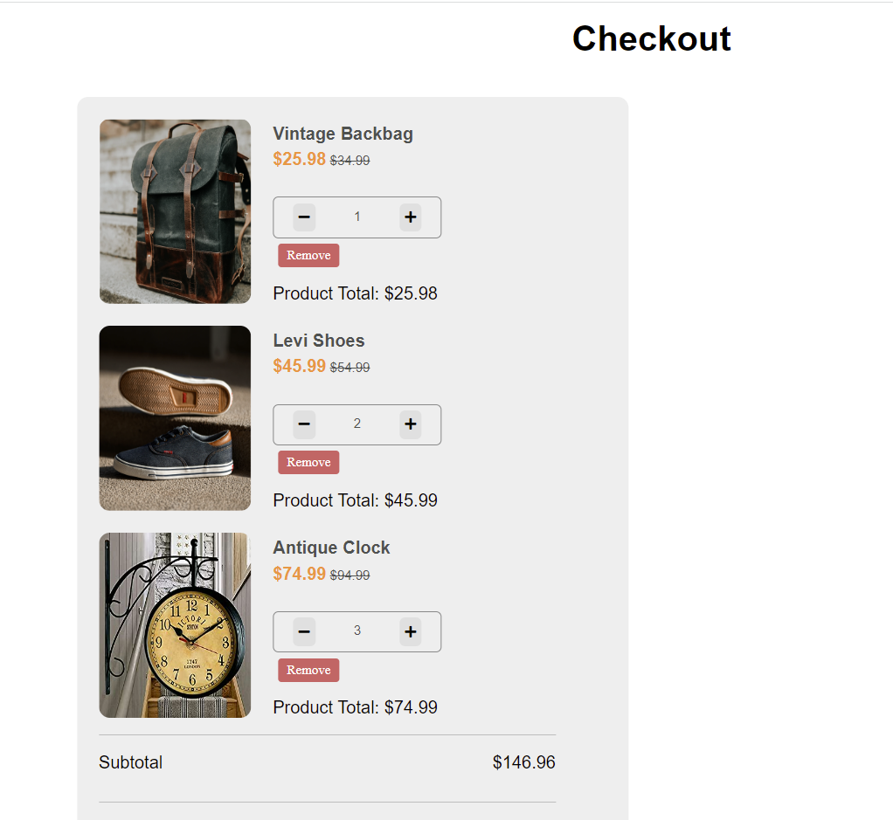
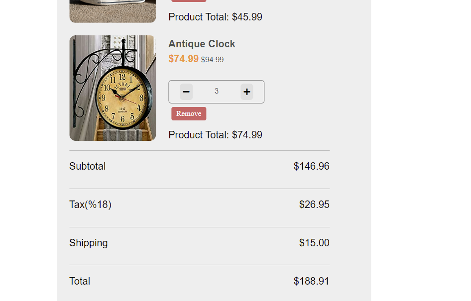

#  :balloon: Online-Shop-Checkout-Page :balloon:
> Shopping checkout page has some default products to add/delete, increase/decrease the amount. You can view sum of prices in detail!

## Table of contents
  - [Table of contents](#table-of-contents)
  - [General info](#general-info)
  - [Technologies](#technologies)
  - [Features](#features)
  - [How to use](#how-to-use)
  - [Screenshots](#screenshots)
  - [Contact](#contact)

## General info
This project is created to sharpen the knowledge of DOM Manupulation along with event listeners. It is a Project of The Clarusway IT School - Fullstack Developer Path.

## Technologies
* HTML
* CSS
* JavaScript

## Features
* Gives the picture and prices of the products
* Increase, decrease or remove the products
* Shows the prices include tax and shipping

## How to use
Click on this [link](https://i-bilge.github.io/Online-Shop-Checkout-Page/)

## Screenshots

## Contact
:mailbox_with_mail: You can send me email : iismailbilge@gmail.com :mailbox_with_mail:
